<h1 align="center">Adarsh Raj</h1>

<h2> 𝐇𝐞𝐥𝐥𝐨 𝐭𝐡𝐞𝐫𝐞, 𝐟𝐞𝐥𝐥𝐨𝐰 <𝚌𝚘𝚍𝚎𝚛𝚜/>! </h2>

<h3 align="center">Building bots, exploring cybersecurity, and creating digital experiences.</h3>

- 🌱 I’m currently learning **Cybersecurity, Networking, Linux & Advanced Python**

- 👯 I’m looking to collaborate on **Cybersecurity Tools, Discord Bots & Open Source Projects**

- 🤝 I’m looking for help with **Backend Scaling, Security Research & Advanced Networking**

- 💬 Ask me about **Discord Bots, JavaScript, Minecraft Servers, Automation & AI**

- 📫 How to reach me **rajadarsh2233@gmail.com**

- ⚡ Fun fact **I play Guitar And Minecraft**

<h3 align="left">Connect with me:</h3>

<h3 align="left">Languages & Tools:</h3>

  

<h3 align="left">Statistics:</h3>

  
  

